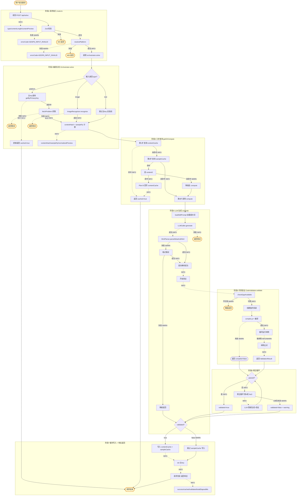

# GESP6 解题服务日志排查指南

**文档目的**：为系统运维人员提供日志排查入口，通过关键字定位业务阶段、判定问题根因。
**适用范围**：`POST /api/solve` 解题服务的全部应用日志（不含 middleware 与客户端日志）。
**最后更新**：2026-07-02

---

## 一、日志格式规范

### 1.1 统一格式

```
[ISO8601时间戳] [LEVEL] [模块.方法] 消息 {JSON上下文}
```

**示例**：
```
[2026-07-02T03:24:37.123Z] [INFO] [SolveRoute] 收到请求 {"type":"text","contentLength":1245,"contentPreview":"# B3614 [基础题]..."}
[2026-07-02T03:24:38.456Z] [WARN] [CodeValidator.compile] g++ 编译失败 {"sourcePath":"/tmp/gesp6-compile-xxx/solution.cpp","elapsedMs":1200,"stderr":"..."}
```

### 1.2 日志级别语义

| 级别 | 含义 | 触发场景 | 运维动作 |
|------|------|---------|---------|
| `INFO` | 正常业务流转节点 | 请求接入、缓存命中、LLM 调用、验证完成等 | 无需处理，用于追踪链路 |
| `WARN` | 异常但已降级处理 | g++ 不可用、编译失败、样例比对失败、降级返回、跳过缓存写入 | 关注趋势，单次可不处理 |
| `ERROR` | 异常未恢复 | 文件读写失败、未预期异常 | 需立即排查 |
| `DEBUG` | 仅开发环境 | 详细调试信息 | 生产环境不输出 |

### 1.3 输出位置

- **开发环境**：标准输出（终端直接可见）
- **生产环境**：`console.log/warn/error` → 由部署平台日志聚合（如 systemd journal、Docker logs、Vercel）
- **不在中间件输出 logger 日志**（Edge Runtime 限制）
- **不在客户端组件输出 logger 日志**（Client Runtime 限制，改用 `logClientError()`）

---

## 二、日志类目总览（按模块）

共计 **6 个模块 / 58 个日志点**。

### 模块 A：SolveRoute（接入层，7 点）

| 日志消息 | 级别 | 关键字段 | 业务意义 |
|---------|------|---------|---------|
| `[SolveRoute] 请求体非合法 JSON` | WARN | elapsedMs | 客户端发送非 JSON body，返回 400 |
| `[SolveRoute] Zod 校验失败` | WARN | issue, elapsedMs | 输入不符合 schema（字段缺失/超长/枚举非法），返回 400 |
| `[SolveRoute] 收到请求` | INFO | type, contentLength, contentPreview | 请求通过校验，进入处理流程 |
| `[SolveRoute] resolvePlatform 失败` | WARN | type, error, elapsedMs | platform 输入无法识别（未配置平台/URL 格式不匹配），返回 400 |
| `[SolveRoute] platform 解析完成` | INFO | platform, problemId | 平台 URL 成功解析出 platform/problemId |
| `[SolveRoute] 请求完成` | INFO | type, success, cached, validated, hasWarning, errorCode, totalElapsedMs | 请求处理完成，**判定整体结果的关键日志** |
| `[SolveRoute] 未预期异常` | ERROR | message, elapsedMs | 兜底捕获未预期异常，返回 500 GESP6_INTERNAL_ERROR |

### 模块 B：Orchestrator（编排层，28 点）

#### B1. solvePlatform 分支（11 点）

| 日志消息 | 级别 | 关键字段 | 业务意义 |
|---------|------|---------|---------|
| `[solvePlatform] 缺少 platform/problemId` | WARN | problem | platform 输入缺少必填字段 |
| `[solvePlatform] 开始` | INFO | platform, problemId | 进入 platform 处理分支 |
| `[solvePlatform] 主 key 查询` | INFO | platform, problemId, primaryKey | 查询主键缓存 |
| `[solvePlatform] 主 key 命中，直接返回` | INFO | cached=true, elapsedMs | **缓存命中，零 LLM token 返回** |
| `[solvePlatform] fetchProblem 完成` | INFO | success, contentLength, platform, problemId, elapsedMs | 平台题目抓取完成 |
| `[solvePlatform] 哈希计算完成` | INFO | platform, problemId, contentHash, contentHashShort, sampleFp, sampleFpShort, hasSampleFp, rawContentLength, normalizedContentLength, normalizedPreview | **contentHash 与 sampleFp 同时计算完成** |
| `[solvePlatform] getOrCompute 完成` | INFO | success, cached, validated, elapsedMs | 三步查询+compute 完成 |
| `[solvePlatform] 主 key 回填完成` | INFO | primaryKey, contentHash | validated=true 时回填主键缓存 |
| `[solvePlatform] 跳过主 key 回填` | WARN | validated, success | validated=false 或失败时不回填主键 |

#### B2. solveTextOrImage 分支（5 点）

| 日志消息 | 级别 | 关键字段 | 业务意义 |
|---------|------|---------|---------|
| `[solveTextOrImage] 开始` | INFO | type | 进入 text/image 处理分支 |
| `[solveTextOrImage] 图片识别完成` | INFO | success, recognizedTextLength, elapsedMs | 图片识别为文本完成 |
| `[solveTextOrImage] 哈希计算完成` | INFO | type, contentHash, sampleFp, hasSampleFp, rawContentLength, normalizedContentLength | text/image 输入的哈希计算 |
| `[solveTextOrImage] getOrCompute 完成` | INFO | success, cached, validated, elapsedMs | 三步查询+compute 完成 |

#### B3. compute 流程（12 点）

| 日志消息 | 级别 | 关键字段 | 业务意义 |
|---------|------|---------|---------|
| `[compute] 开始 LLM 生成流程` | INFO | contentLength | 进入 LLM 生成流程 |
| `[compute] LLM 生成完成` | INFO | success, rawLength, elapsedMs | LLM 返回原始文本 |
| `[compute] 首次解析` | INFO | retryRound | 开始解析 META+HTML |
| `[compute] 格式重试` | INFO | retryRound | 解析失败，重试 LLM（最多 2 次） |
| `[compute] 解析失败，降级返回原始 HTML` | WARN | errorCode, retryRound | 2 次解析均失败，降级返回 |
| `[compute] 解析成功` | INFO | hasCode, codeLength, samplesCount | META+HTML 解析成功 |
| `[compute] 首次验证` | INFO | - | 调用 CodeValidator |
| `[compute] g++ 不可用，降级返回` | WARN | - | g++ 不可用，跳过验证降级 |
| `[compute] 首次验证通过` | INFO | - | 首次验证即通过，无需修正 |
| `[compute] 进入修正循环` | INFO | maxRounds | 进入修正循环（最多 3 轮） |
| `[compute] 修正调用完成` | INFO | round, success, elapsedMs | 第 N 轮修正 LLM 调用完成 |
| `[compute] 修正输出解析失败，降级返回` | WARN | round | 修正输出格式不合规，降级返回 |
| `[compute] 修正后重新验证` | INFO | round | 修正后重新调用 CodeValidator |
| `[compute] 修正后验证通过` | INFO | round | 第 N 轮修正后验证通过 |
| `[compute] 3 次修正后仍未通过` | WARN | - | 3 次修正仍失败，validated=false 返回 |

### 模块 C：CodeValidator（验证层，11 点）

| 日志消息 | 级别 | 关键字段 | 业务意义 |
|---------|------|---------|---------|
| `[CodeValidator.validate] 开始验证` | INFO | codeLength, codeLineCount, samplesCount | 进入验证流程 |
| `[CodeValidator.validate] g++ 可用性检查` | INFO | available, elapsedMs | g++ 可用性检测结果 |
| `[CodeValidator.validate] g++ 不可用，跳过验证` | WARN | codeLength | g++ 不可用，降级 |
| `[CodeValidator.validate] 验证完成` | INFO | compiled, passed, failuresCount, errorsCount, errorCode, totalElapsedMs | **验证整体结果** |
| `[CodeValidator.validateInternal] 临时目录已创建` | INFO | workDir, sourcePath, binaryPath | 临时目录创建 |
| `[CodeValidator.validateInternal] 编译失败` | WARN | sourcePath, error, errorPreview | g++ 编译失败 |
| `[CodeValidator.validateInternal] 编译成功` | INFO | sourcePath, binaryPath | g++ 编译成功 |
| `[CodeValidator.validateInternal] 开始运行样例` | INFO | samplesCount, trimEnabled | 进入样例运行 |
| `[CodeValidator.validateInternal] 样例运行失败` | WARN | sampleIndex, runElapsedMs, error, inputPreview | 样例运行出错（超时/非零退出） |
| `[CodeValidator.validateInternal] 样例比对失败` | WARN | sampleIndex, runElapsedMs, inputPreview, expectedPreview, actualPreview, expectedLength, actualLength | **样例输出与期望不符，关键诊断日志** |
| `[CodeValidator.validateInternal] 样例通过` | INFO | sampleIndex, runElapsedMs | 单个样例通过 |
| `[CodeValidator.validateInternal] 样例运行完成` | INFO | totalSamples, passedCount, failedCount | 所有样例运行完成 |
| `[CodeValidator.validateInternal] 验证过程异常` | ERROR | message, workDir | 验证过程未预期异常 |
| `[CodeValidator.validateInternal] 临时目录清理失败` | WARN | workDir, message | 临时目录清理失败（不影响结果） |
| `[CodeValidator.compile] 调用 g++ 编译` | INFO | sourcePath, binaryPath, timeoutMs | 调用 g++ 编译 |
| `[CodeValidator.compile] g++ 编译失败` | WARN | sourcePath, elapsedMs, errorMessage, stderr | **g++ 编译失败详情，含 stderr** |
| `[CodeValidator.compile] g++ 编译成功` | INFO | sourcePath, binaryPath, elapsedMs | g++ 编译成功 |

### 模块 D：FsHtmlCache（文件系统缓存层，30 点）

#### D1. 查询类

| 日志消息 | 级别 | 关键字段 | 业务意义 |
|---------|------|---------|---------|
| `[getByPrimaryKey] primary 索引不存在` | INFO | primaryKey | 主键缓存未命中 |
| `[getByPrimaryKey] primary 索引命中` | INFO | primaryKey, contentHash | 主键缓存命中 |
| `[getByPrimaryKey] 读取异常` | ERROR | primaryKey, message | 主键索引读取异常 |
| `[getByContentKey] content 文件缺失` | INFO | contentHash | 内容缓存文件不存在 |
| `[getByContentKey] meta 文件损坏` | WARN | contentHash | meta.json 解析失败 |
| `[getByContentKey] content 命中` | INFO | contentHash, htmlLength | 内容缓存命中 |
| `[getByContentKey] 读取异常` | ERROR | contentHash, message | 内容缓存读取异常 |
| `[getBySampleFingerprint] sample 索引不存在` | INFO | sampleFp | 样例指纹未命中 |
| `[getBySampleFingerprint] sample 索引命中` | INFO | sampleFp, contentHash | 样例指纹命中 |
| `[getBySampleFingerprint] 读取异常` | ERROR | sampleFp, message | 样例指纹读取异常 |

#### D2. 写入类

| 日志消息 | 级别 | 关键字段 | 业务意义 |
|---------|------|---------|---------|
| `[set] 写入主 key + content` | INFO | primaryKey, contentHash, htmlLength | 写入主键+内容缓存 |
| `[set] 写入失败` | ERROR | primaryKey, contentHash, message | 写入失败 |
| `[writeContentFiles] 写入 content 文件` | INFO | contentHash, htmlLength | 写入内容文件 |
| `[writeContentFiles] HTML 写入失败` | ERROR | contentHash, message | HTML 文件写入失败 |
| `[writeContentFiles] meta 写入失败` | ERROR | contentHash, message | meta 文件写入失败 |
| `[writeSampleIndex] 写入 sample 索引（FR-008 validated=true 触发）` | INFO | sampleFp, contentHash | **样例索引写入触发，仅 validated=true 时** |
| `[writeSampleIndex] sample 索引写入成功` | INFO | sampleFp, contentHash, indexPath | 样例索引写入成功 |
| `[writeSampleIndex] sample 索引写入失败` | ERROR | sampleFp, contentHash, message | 样例索引写入失败 |

#### D3. getOrCompute 三步查询（核心）

| 日志消息 | 级别 | 关键字段 | 业务意义 |
|---------|------|---------|---------|
| `[getOrCompute] 开始三步查询` | INFO | contentHash, contentHashShort, sampleFp, sampleFpShort, hasSampleFp | **三步查询入口** |
| `[getOrCompute] 第 1 步 content 命中，直接返回` | INFO | contentHash, elapsedMs | **第 1 步命中，零 LLM** |
| `[getOrCompute] 第 2 步 sample 索引命中，查 content2` | INFO | sampleFp, contentHash2 | **第 2 步命中，进入 Plan B** |
| `[getOrCompute] 第 2 步 content2 命中，Plan B 回写` | INFO | sampleFp, contentHash, contentHash2 | **Plan B 回写 contentCache** |
| `[getOrCompute] Plan B 返回（cached: true）` | INFO | sampleFp, elapsedMs | **Plan B 完成，零 LLM** |
| `[getOrCompute] 第 2 步 content2 未命中（索引失效），降级走 compute` | WARN | sampleFp, contentHash2 | **样例指纹命中但内容缓存缺失，降级** |
| `[getOrCompute] 第 2 步 sample 索引未命中` | INFO | sampleFp | 第 2 步未命中 |
| `[getOrCompute] 第 3 步 in-flight 命中，复用 Promise` | INFO | contentHash | 相同 contentHash 并发请求复用 |
| `[getOrCompute] 第 3 步 发起 compute` | INFO | contentHash | **三步全未命中，调用 compute** |
| `[getOrCompute] compute 完成` | INFO | success, validated, elapsedMs | compute 完成 |
| `[getOrCompute] 跳过 sample 索引写入（validated=false）` | WARN | sampleFp | **validated=false 跳过 sample 索引写入（FR-008）** |
| `[getOrCompute] 异常` | ERROR | contentHash, message | getOrCompute 未预期异常 |

### 模块 E：DualKeyHtmlCache（内存缓存层，22 点）

> 内存模式（`GESP6_CACHE_DRIVER` 未设置为 `fs` 时启用）。
> 日志类目与 FsHtmlCache 对齐，区别：无文件路径信息、无异步写入日志。

核心日志：

| 日志消息 | 级别 | 业务意义 |
|---------|------|---------|
| `[getByPrimaryKey] 查询` | INFO | 主键查询 |
| `[getByContentKey] 查询` | INFO | 内容键查询 |
| `[getBySampleFingerprint] 未命中` / `命中` | INFO | 样例指纹查询 |
| `[set] 写入` | INFO | 缓存写入 |
| `[getOrCompute] 开始三步查询` | INFO | 三步查询入口 |
| `[getOrCompute] 第 1 步 content 命中，直接返回` | INFO | 第 1 步命中 |
| `[getOrCompute] 第 2 步 sample 索引命中，查 content2` | INFO | 第 2 步命中 |
| `[getOrCompute] 第 2 步 content2 命中，Plan B 回写` | INFO | Plan B 回写 |
| `[getOrCompute] 第 2 步 content2 未命中（索引失效），降级走 compute` | WARN | 降级 |
| `[getOrCompute] 跳过 sample 索引写入（validated=false）` | WARN | 跳过写入 |

### 模块 F：extractSampleFingerprint（指纹层，2 点）

| 日志消息 | 级别 | 关键字段 | 业务意义 |
|---------|------|---------|---------|
| `[extractSampleFingerprint] 提取完成` | INFO | contentLength, sampleRangeLength, usedFallback, usedHeaderFallback, blockCount, blocksPreview, sampleFp, sampleFpShort, elapsedMs | **样例指纹提取结果**（usedHeaderFallback=true 表示走了"输入：/输出："兜底路径） |
| `[extractSampleFingerprint] 无代码块且无 输入：/输出： 模式，返回空字符串（降级信号 FR-003）` | INFO | contentLength, usedFallback, elapsedMs | 无代码块且无标题模式，跳过 sample 查询 |

---

## 三、业务提交流程图与日志对应关系



### 三类业务路径速查

| 路径类型 | 链路 | 日志特征 |
|---------|------|---------|
| **纯缓存命中**（零 LLM） | 阶段1 → 阶段2 主key命中 / 阶段3 第1步或第2步命中 → 阶段7 | `cached=true`，无 `compute` 日志 |
| **完整生成**（首次请求） | 阶段1 → 阶段2 → 阶段3 第3步 → 阶段4 LLM → 阶段5 g++ → 阶段6 → 阶段7 | `cached=false, validated=true`，含 `compute`/`compile`/`样例` 日志 |
| **降级返回**（异常但可用） | 阶段5 g++ 不可用 / 阶段4 格式错误 / 阶段6 3次失败 → 阶段7 | `validated=false, hasWarning=true`，含 `WARN` 降级日志 |

---

## 四、常见问题排查场景

### 场景 A：用户反馈"提交后无响应 / 响应很慢"

**排查步骤**：

1. **定位请求**：grep 用户提交时间附近的 `[SolveRoute] 收到请求`
   ```bash
   grep "\[SolveRoute\] 收到请求" <log> | grep "contentPreview.*<题目关键字>"
   ```

2. **判定阶段**：查看同时间窗的 `[SolveRoute] 请求完成` 日志
   - 若 `totalElapsedMs > 30000` → 卡在 LLM 或 g++
   - 若无 `请求完成` 日志 → 服务端崩溃或超时

3. **细分阶段**（按时间窗 grep 关键字）：
   - `getOrCompute` → 卡在三步查询？
   - `LLM 生成完成` → LLM 耗时？（关注 `elapsedMs`）
   - `g++ 编译成功` / `g++ 编译失败` → g++ 耗时？
   - `修正调用完成` → 修正循环走了几轮？（关注 `round`）

4. **常见根因**：
   - LLM 超时 → 检查 `[compute] LLM 生成完成` 是否有 `errorCode=GESP6_LLM_TIMEOUT`
   - g++ 编译卡住 → 检查 `[CodeValidator.compile]` 的 `elapsedMs`，超过 10s 应被超时杀掉
   - 修正循环 3 次仍失败 → 检查 `[compute] 3 次修正后仍未通过`

### 场景 B：用户反馈"返回结果代码不正确"

**排查步骤**：

1. **定位请求**：同场景 A 第 1 步

2. **检查验证日志**：
   ```bash
   grep "CodeValidator" <log> | grep -E "(样例比对失败|样例运行失败|编译失败)"
   ```

3. **判定根因**：
   - `g++ 编译失败` → 查 `stderr` 字段，是 LLM 生成的代码语法错误
   - `样例比对失败` → 查 `expectedPreview` vs `actualPreview`，是逻辑错误
   - `样例运行失败` → 查 `error` 字段，可能是运行时错误（如段错误、超时）

4. **检查是否降级**：
   - 若 `validated=false` 且 `hasWarning=true` → 系统已降级返回未验证代码
   - 查 `[compute] 3 次修正后仍未通过` 确认修正循环已耗尽

### 场景 C：用户反馈"重复提交相同题目仍然很慢"

**预期行为**：相同题目二次提交应命中缓存（`cached=true`），无 LLM 调用。

**排查步骤**：

1. **检查主键缓存**：
   ```bash
   grep "主 key" <log>
   ```
   - `主 key 命中，直接返回` → 主键缓存正常
   - `主 key 查询` 后无 `命中` → 主键缓存失效，继续排查

2. **检查内容缓存（第 1 步）**：
   ```bash
   grep "第 1 步 content" <log>
   ```
   - `第 1 步 content 命中，直接返回` → 内容缓存正常

3. **检查样例指纹（第 2 步）**：
   ```bash
   grep "第 2 步" <log>
   ```
   - `第 2 步 sample 索引命中` + `Plan B 回写` → Plan B 正常
   - `第 2 步 content2 未命中（索引失效），降级走 compute` → **样例索引指向的 content 文件被删除/损坏**

4. **检查是否写入失败**：
   ```bash
   grep -E "(写入失败|sample 索引写入失败|HTML 写入失败)" <log>
   ```

5. **检查 validated 状态**：
   - `跳过 sample 索引写入（validated=false）` → 验证未通过，sample 索引未写入，下次相同题目无法命中第 2 步

### 场景 D：缓存命中率异常下降

**排查步骤**：

1. **统计缓存命中分布**：
   ```bash
   grep -c "主 key 命中" <log>          # 主键命中次数
   grep -c "第 1 步 content 命中" <log>  # 内容命中次数
   grep -c "Plan B 返回" <log>           # Plan B 命中次数
   grep -c "第 3 步 发起 compute" <log>  # 完整生成次数
   ```

2. **判定异常**：
   - 若 `第 3 步 发起 compute` 占比突增 → 缓存大面积失效
   - 若 `第 2 步 content2 未命中（索引失效）` 频繁出现 → content 文件丢失

3. **检查文件系统**（fs 模式）：
   ```bash
   ls /var/learning/.data/gesp6/primary/   # 主键索引
   ls /var/learning/.data/gesp6/content/   # 内容文件（按 hash 前缀分桶）
   ls /var/learning/.data/gesp6/sample/    # 样例指纹索引
   ```

4. **检查 validated=false 比例**：
   ```bash
   grep -c "跳过 sample 索引写入" <log>
   ```
   比例高 → LLM 生成代码质量下降或 g++ 环境异常。

### 场景 E：g++ 编译失败批量出现

**排查步骤**：

1. **统计编译失败**：
   ```bash
   grep "g++ 编译失败" <log> | wc -l
   ```

2. **检查 g++ 可用性**：
   ```bash
   grep "g++ 可用性检查" <log> | grep '"available":false'
   ```
   若出现 `available:false` → g++ 环境崩溃，立即检查：
   ```bash
   which g++
   g++ --version
   ```

3. **检查并发限制**：
   - 默认 `GESP6_COMPILE_CONCURRENCY=2`，过高并发会导致 g++ 资源争抢
   - 检查 `validate` 的 `totalElapsedMs` 是否普遍接近 10s 超时

4. **检查 stderr 内容**：
   - `stderr` 含 `error:` → LLM 生成的代码语法错误（单次问题）
   - `stderr` 含 `internal compiler error` → g++ 自身故障（需重装）
   - `stderr` 含 `No space left on device` → 磁盘满，清理 `/tmp/gesp6-compile-*`

### 场景 F：LLM 调用失败

**排查步骤**：

1. **统计失败类型**：
   ```bash
   grep "LLM 生成完成" <log> | grep -o '"errorCode":"[^"]*"' | sort | uniq -c
   ```

2. **常见错误码**：
   | errorCode | 含义 | 处理 |
   |---------|------|------|
   | `GESP6_LLM_TIMEOUT` | LLM 调用超时 | 检查 LLM 服务可用性、网络 |
   | `GESP6_LLM_RATE_LIMIT` | 触发限流（429） | 降低并发或联系 LLM 提供方 |
   | `GESP6_LLM_NETWORK_ERROR` | 网络错误 | 检查出网配置 |
   | `GESP6_LLM_FORMAT_ERROR` | 输出格式不合规 | LLM 输出质量问题，检查 prompt |

3. **检查重试日志**：
   - `[compute] 格式重试` → 已自动重试，最多 2 次
   - `[compute] 解析失败，降级返回原始 HTML` → 重试耗尽，降级

### 场景 G：Plan B 回写异常

**预期行为**：样例指纹命中 + content2 命中 → 应触发 Plan B 回写。

**排查步骤**：

1. **统计 Plan B 触发**：
   ```bash
   grep -c "Plan B 回写" <log>
   ```

2. **统计 Plan B 失效**：
   ```bash
   grep "第 2 步 content2 未命中（索引失效）" <log>
   ```
   出现此日志说明：sample 索引指向的 contentHash 对应的内容文件丢失。

3. **检查 sample 索引完整性**（fs 模式）：
   ```bash
   ls /var/learning/.data/gesp6/sample/ | wc -l
   ```
   与 content 文件数量对比，若 sample 远多于 content → content 文件被误删。

4. **检查 FR-008 写入条件**：
   ```bash
   grep "跳过 sample 索引写入" <log> | wc -l
   ```
   此日志频繁出现是正常的（validated=false 时不写 sample 索引），但会导致下次相同样例无法 Plan B 命中。

---

## 五、日志关键字速查表

| 关键字 | 含义 | 模块 |
|--------|------|------|
| `[SolveRoute] 收到请求` | 请求接入 | A |
| `[SolveRoute] 请求完成` | 请求结束（看整体结果） | A |
| `主 key 命中` | 主键缓存命中 | B/D |
| `主 key 回填完成` | 主键缓存写入 | B |
| `哈希计算完成` | contentHash + sampleFp 计算完成 | B/F |
| `开始三步查询` | getOrCompute 入口 | D/E |
| `第 1 步 content 命中` | 内容缓存命中 | D/E |
| `第 2 步 sample 索引命中` | 样例指纹命中 | D/E |
| `Plan B 回写` | Plan B 触发 | D/E |
| `第 2 步 content2 未命中（索引失效）` | Plan B 失效降级 | D/E |
| `第 3 步 发起 compute` | 三步全未命中，调 LLM | D/E |
| `跳过 sample 索引写入（validated=false）` | FR-008 跳过写入 | D/E |
| `LLM 生成完成` | LLM 调用结束 | B |
| `g++ 可用性检查` | g++ 检测 | C |
| `g++ 编译失败` | g++ 编译错误 | C |
| `g++ 编译成功` | g++ 编译通过 | C |
| `样例比对失败` | 样例输出不符 | C |
| `样例运行失败` | 样例运行出错 | C |
| `3 次修正后仍未通过` | 修正循环耗尽 | B |
| `降级返回` | 异常降级 | B/C |
| `降级走 compute` | Plan B 降级 | D/E |

---

## 六、错误码对照表

| errorCode | 触发模块 | 含义 | 用户侧表现 |
|-----------|---------|------|----------|
| `GESP6_INPUT_INVALID` | SolveRoute | 输入校验失败 | 400 |
| `GESP6_INTERNAL_ERROR` | SolveRoute | 未预期异常 | 500 |
| `GESP6_PLATFORM_FETCH_FAILED` | fetchProblem | 平台抓取失败 | 503 |
| `GESP6_MODEL_NOT_SUPPORTED` | ImageRecognizer | 模型不支持图片 | 503 |
| `GESP6_LLM_TIMEOUT` | LLMCaller | LLM 调用超时 | 503 |
| `GESP6_LLM_RATE_LIMIT` | LLMCaller | LLM 限流（429） | 503 |
| `GESP6_LLM_NETWORK_ERROR` | LLMCaller | LLM 网络错误 | 503 |
| `GESP6_LLM_FORMAT_ERROR` | HtmlParser | LLM 输出格式不合规 | 200 + warning |
| `GESP6_COMPILE_ENV_ERROR` | CodeValidator | g++ 不可用 | 200 + warning |
| `GESP6_VALIDATE_TIMEOUT` | CodeValidator | 验证超时 | 200 + warning |

---

## 七、健康检查指标

运维侧建议监控以下指标（基于日志统计）：

| 指标 | 计算方式 | 健康阈值 |
|------|---------|---------|
| 请求成功率 | `请求完成 success=true` / `收到请求` | ≥ 95% |
| 缓存命中率 | (`主 key 命中` + `第 1 步 content 命中` + `Plan B 返回`) / `收到请求` | ≥ 60%（首次提交多的场景除外） |
| LLM 平均耗时 | `LLM 生成完成` 的 `elapsedMs` 均值 | ≤ 15s |
| g++ 编译失败率 | `g++ 编译失败` / `g++ 编译成功+失败` | ≤ 20% |
| 修正循环触发率 | `进入修正循环` / `LLM 生成完成` | ≤ 30% |
| 3 次修正失败率 | `3 次修正后仍未通过` / `进入修正循环` | ≤ 20% |
| 降级返回率 | `validated=false` / `请求完成 success=true` | ≤ 15% |

---

## 八、附录

### 8.1 日志输出位置

- **应用日志**：`@/app/lib/logging/logger` → `console.log/warn/error`
- **中间件日志**：`console`（Edge Runtime 限制，禁止 logger）
- **客户端日志**：`logClientError()` → `console.error`

### 8.2 相关文件

| 文件 | 作用 |
|------|------|
| `app/lib/logging/logger.ts` | 日志工具定义 |
| `app/api/solve/route.ts` | 接入层日志（7 点） |
| `app/lib/ai/services/orchestrator.ts` | 编排层日志（28 点） |
| `app/lib/ai/services/code-validator.ts` | 验证层日志（11 点） |
| `app/lib/ai/services/fs-html-cache.ts` | FS 缓存层日志（30 点） |
| `app/lib/ai/services/html-cache.ts` | 内存缓存层日志（22 点） |
| `app/lib/ai/services/problem-fetchers/types.ts` | 指纹层日志（2 点） |
| `app/lib/ai/services/__tests__/logging-pipeline.test.ts` | 日志专项测试（11 用例） |

### 8.3 相关文档

- [Spec：样例指纹缓存层 v1.1](../specs/spec-sample-fingerprint-cache-v1.0.md)
- [架构文档](../architecture/)
- [更新日志：样例指纹缓存层](../changelog/2026-07-02-样例指纹缓存层.md)
