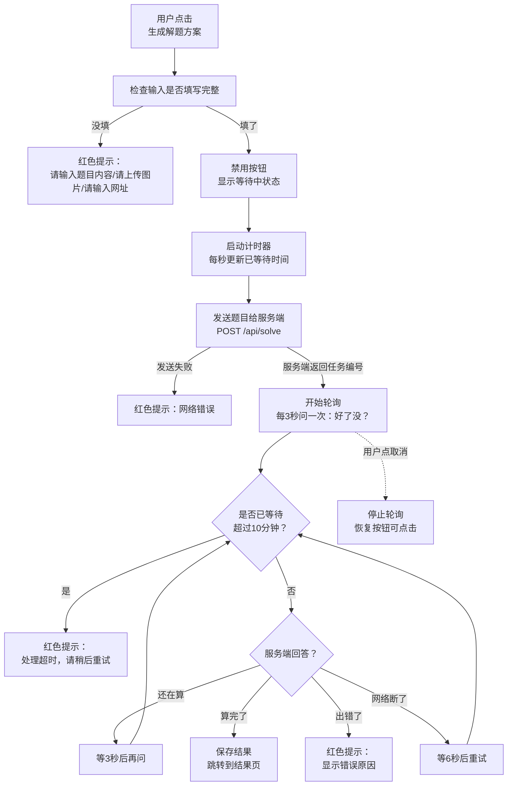
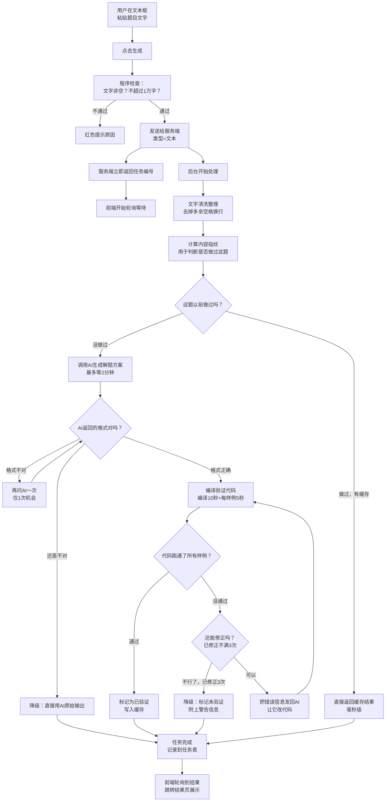
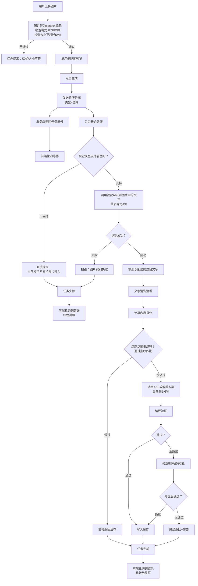
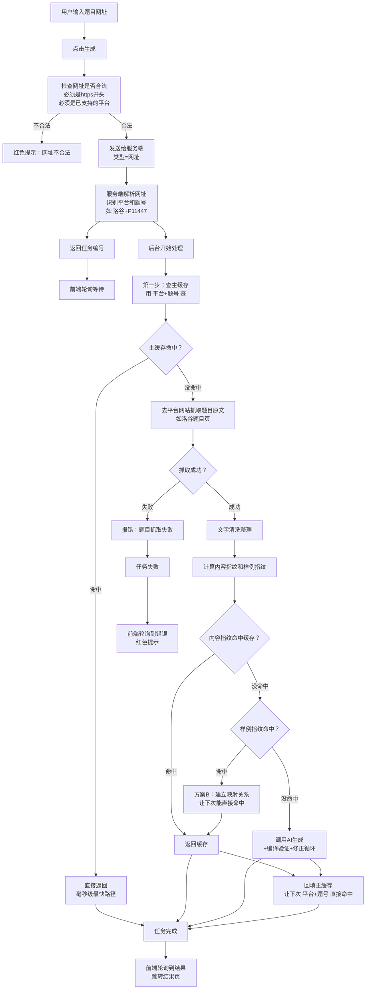

# 超时处理机制与流程分析

**文档目的**：用通俗语言梳理"用户提交题目 → AI 解题 → 显示结果"全流程中的超时处理、等待逻辑、日志记录和页面交互，并指出设计中不够合理的环节。

**适用读者**：产品、运维、开发

***

## 一、系统在做什么（背景）

用户通过网页提交一道 C++ 编程题（三种方式：粘贴文字、上传图片、填写题目网址），系统调用 AI 大模型生成一份包含解题思路、代码、流程图、思维导图的 HTML 网页，编译验证代码正确性，最终展示给用户。

整个流程通常需要 **2-5 分钟**，涉及多次 AI 调用和程序编译，因此"等多久""什么时候放弃""放弃了之后后台怎么办"是核心设计问题。

***

## 二、超时机制总览（6 层"耐心上限"）

系统从外到内有 6 层"耐心上限"，每层的角色和后果不同：

| 层级              | 谁在等     | 耐心上限              | 超时后的动作        | 通俗解释                  |
| --------------- | ------- | ----------------- | ------------- | --------------------- |
| **L1 用户浏览器**    | 用户的前端页面 | **10 分钟**         | 停止轮询，提示"处理超时" | "用户等了10分钟还没结果，页面放弃等待" |
| **L2 服务端任务记录**  | 后台任务登记表 | **30 分钟**         | 删除这条任务记录      | "任务完成后保留30分钟供查询，超期清理" |
| **L3 单次 AI 调用** | AI 接口调用 | **120 秒**         | 返回"AI 调用超时"错误 | "一次 AI 对话最多等2分钟"      |
| **L4 AI 调用重试**  | 重试逻辑    | **3 次**（间隔1→2→4秒） | 放弃重试，返回错误     | "遇到限流/断网重试3次，仍失败就报错"  |
| **L5 程序编译**     | g++ 编译器 | **10 秒**          | 终止编译，返回编译失败   | "编译 C++ 代码最多等10秒"     |
| **L6 样例运行**     | 编译后程序运行 | **5 秒**           | 终止运行，标记样例失败   | "跑一个测试用例最多等5秒"        |

### 关键关系图

```
用户提交
  │
  ├─ L1 浏览器开始计时（10分钟上限）
  │
  └─ 服务端创建任务（L2 30分钟上限）
       │
       ├─ 图片识别（L3 120秒/次 × L4 最多3次重试）
       │
       ├─ AI 生成解题方案（L3 120秒/次 × L4 最多3次重试）
       │
       ├─ 编译验证（L5 10秒 + L6 每个样例5秒）
       │
       └─ 修正循环（最多3轮，每轮含1次AI调用+1次编译验证）
```

**最坏情况耗时估算**（图片提交 + 3轮修正全部触发）：

```
图片识别:  120秒
AI 生成:   120秒
编译验证:   15秒（编译10秒 + 1个样例5秒）
修正第1轮: 120秒(AI) + 15秒(编译) = 135秒
修正第2轮: 120秒(AI) + 15秒(编译) = 135秒
修正第3轮: 120秒(AI) + 15秒(编译) = 135秒
────────────────────────────────
合计:      约 735 秒 ≈ 12.25 分钟
```

**这个数字超过了 L1 的 10 分钟上限**，意味着图片提交触发3轮修正时，用户必然在看到结果前就超时了。这是当前设计的一个明确问题（详见第六节分析）。

***

## 三、手机端与电脑端的差异

### 结论：完全没有差异

代码中不存在任何"判断用户用的是手机还是电脑"的逻辑。同一份页面代码在所有浏览器上运行，超时时间、轮询频率、提示文字、按钮行为完全相同。

**唯一的"差异"来自浏览器自身**（非代码控制）：

- iPhone Safari 对单个网络请求约 60 秒无响应就断开连接
- 安卓 Chrome 约 300 秒断开
- 电脑浏览器通常不主动断开

这正是之前采用"轮询模式"的原因：把一个长请求拆成很多个秒级短请求，规避浏览器对长连接的超时杀除。轮询模式下每次请求仅持续几十毫秒，不会触发任何浏览器的连接超时。

***

## 四、三种提交方式的完整流程图

以下流程图用通俗语言标注，括号内标注对应的程序模块名便于开发定位。

### 4.1 三种方式共享的"前端等待流程"

无论用户用哪种方式提交，点击按钮后的等待逻辑完全相同：



**涉及的核心程序文件**：

- 等待逻辑 → `app/solve/page.tsx` 的 `pollJob` 函数
- 任务编号管理 → `app/lib/job-store.ts`
- 接口处理 → `app/api/solve/route.ts`

### 4.2 提交方式一：文本输入

用户直接粘贴题目文字（含题目描述和样例输入输出）。



**特点**：最直接的路径。如果没有缓存，最快约 2 分钟（1次AI生成+1次编译验证），最慢约 10 分钟（1次生成+3轮修正）。

### 4.3 提交方式二：图片上传

用户上传题目照片（文件选择 / 截图粘贴 / 摄像头拍照）。



**特点**：比文本输入多了一个"图片识别"步骤（约30-60秒），因此整体耗时更长。最坏情况约 12 分钟，**超过前端10分钟上限**。

### 4.4 提交方式三：平台网址

用户输入洛谷或有道小图灵的题目网址。



**特点**：有"双层缓存"优势。即使内容指纹没命中，样例指纹也可能命中（比如别人用文本方式提交过同一题）。主缓存命中时是最快的路径（毫秒级）。

***

## 五、日志与页面状态说明

### 5.1 日志格式

所有后台日志统一格式：

```
[时间戳] [级别] [模块名] 描述文字 {关键参数JSON}
```

举例：

```
[2026-07-02T14:58:47] [INFO] [JobStore] 任务已创建 {"jobId":"c8219c8c-..."}
[2026-07-02T14:59:15] [INFO] [Orchestrator] 图片识别完成 {"success":true,"耗时":34253}
[2026-07-02T15:02:08] [INFO] [JobStore] 任务已完成 {"jobId":"...","总耗时":201000,"命中缓存":false,"已验证":true}
```

**前端无日志**：浏览器端的代码不允许使用后台日志工具（运行环境限制），只用 `console.error`。当前前端在出错时没有显式记录日志，网络错误时静默重试。

### 5.2 页面状态与用户看到的提示

| 状态      | 用户看到什么                                                 | 按钮状态            | 颜色 |
| ------- | ------------------------------------------------------ | --------------- | -- |
| **空闲**  | 正常的输入界面                                                | "生成解题方案"可点击     | 默认 |
| **等待中** | 蓝色提示框 + 转圈动画 + "AI 正在解题中，请耐心等待...（已等待 2分15秒）" + "取消"按钮 | 主按钮显示"处理中..."禁用 | 蓝色 |
| **完成**  | 自动跳转到结果页，展示HTML                                        | —               | —  |
| **超时**  | 红色提示框："处理超时（>10分钟），请稍后重试或重新提交"                         | 按钮恢复可点击         | 红色 |
| **出错**  | 红色提示框：显示错误原因（可能是技术性错误码）                                | 按钮恢复可点击         | 红色 |
| **取消**  | 回到空闲状态，无额外提示                                           | 按钮恢复可点击         | 默认 |

### 5.3 日志在各阶段的记录内容

| 阶段    | 记录什么               | 为什么记     |
| ----- | ------------------ | -------- |
| 收到提交  | 输入类型、内容长度、内容前80字预览 | 排查输入问题   |
| 任务创建  | 任务编号               | 关联全流程    |
| 图片识别  | 成功否、识别文本长度、耗时、错误原因 | 排查识别失败   |
| 缓存查询  | 内容指纹、样例指纹、是否命中、耗时  | 排查缓存命中率  |
| AI 生成 | 成功否、输出长度、耗时、错误码    | 排查AI调用问题 |
| 编译验证  | 编译成功否、样例通过数、失败详情   | 排查代码正确性  |
| 修正循环  | 第几轮、成功否、耗时         | 排查修正效果   |
| 任务完成  | 总耗时、是否命中缓存、是否验证通过  | 性能监控     |

***

## 六、不合理环节分析

以下是逐一分析当前设计中值得商榷的环节，按严重程度排序。

### 问题1：用户放弃后服务端继续计算（严重）

**现象**：用户等了10分钟超时（或主动点取消），前端停止轮询。但后台的 AI 调用、编译验证、修正循环仍在继续，直到完成或30分钟任务记录过期。

**设计意图**：是的，这是为了缓存。如果代码验证通过（validated=true），结果会写入内容缓存（HtmlCache），下一个用户提交同一题时能直接命中缓存，秒级返回。

**为什么不合理**：

1. **缓存命中率有多高？** 信息学奥赛题库有数千道题，同一道题被多个用户同时提交的概率并不高。为低概率的缓存命中而100%完成已放弃的计算，投入产出比不合理。
2. **失败的计算完全浪费**：如果3轮修正后仍未通过验证（validated=false），结果**不写入主缓存**，计算资源100%浪费。这部分场景在代码质量不高的题目中并不罕见。
3. **成本问题**：一次完整计算涉及 4-7 次 AI 调用（1次生成 + 最多3次修正 + 可能1次图片识别）。按当前 AI 调用价格，每次约 0.1-0.5 元，一个被放弃的任务浪费 0.4-3.5 元。
4. **无法恢复**：用户超时后任务编号丢失，即使后悔想看结果也拿不到（除非重新提交同一题碰缓存）。

**建议方案**：

- 前端取消时发送一个"放弃"信号给服务端（如 `DELETE /api/solve?jobId=xxx`）
- 服务端收到后标记任务为"已取消"，orchestrator 在每轮循环前检查标记，若已取消则跳过后续步骤
- AI 调用本身无法中途取消（SDK限制），但可以避免发起后续的修正轮次和编译验证
- 至少在"修正循环"的每轮开始前检查取消标记，能省下 50-75% 的后续成本

***

### 问题2：图片提交最坏耗时超过客户端超时（严重）

**现象**：图片提交最坏约 12.25 分钟，超过前端 10 分钟上限。用户必然在看到结果前超时。

**为什么不合理**：

1. **必然失败的路径**：这不是"可能出问题"，而是"图片提交+代码需要修正"时必然超时。
2. **结果用户看不到但服务端仍在算**：触发问题1的浪费，且浪费更严重（图片路径本身已经多花30-60秒识别）。
3. **用户感知差**：等了10分钟看到"超时"，但不知道其实再等2分钟就有结果了。

**建议方案**：

- 方案A：图片提交时将前端超时提高到 15 分钟，并在提示中说明"图片识别可能需要更长时间"
- 方案B：限制图片路径的修正轮次为 1 次（而非3次），控制最坏耗时在 8 分钟内
- 方案C（推荐）：增加进度阶段反馈，让用户知道"当前在修正第2轮，预计还需3分钟"，用户可决定是否继续等

***

### 问题3：无进度阶段反馈（中等）

**现象**：用户等待期间只看到"AI 正在解题中...（已等待 2分15秒）"，不知道当前卡在哪个环节。

**为什么不合理**：

1. **用户焦虑**：等了3分钟不知道是正常还是卡住了。图片识别慢（30-60秒）是正常的，但用户不知道。
2. **无法判断是否该继续等**：如果显示"正在编译验证代码（预计还需15秒）"，用户会愿意等；如果显示"正在修正第3轮代码（预计还需2分钟）"，用户也能判断。
3. **技术可行但未实现**：job-store 当前只存 `processing`/`done`/`error` 三种状态，可以扩展为 `recognizing`/`generating`/`compiling`/`fixing` 等阶段。

**建议方案**：

- 任务记录增加 `stage` 字段和 `stageMessage` 字段
- orchestrator 在每个阶段切换时更新 stage
- 前端轮询时拿到 stage 显示对应提示，如"正在识别图片中的题目..."、"AI 正在生成解题方案..."、"正在编译验证代码（第2轮修正）..."

***

### 问题4：网络错误无限重试（中等）

**现象**：轮询时遇到网络错误，前端会每 6 秒重试一次，直到 10 分钟超时。没有重试次数上限。

**为什么不合理**：

1. **弱网加剧**：网络不好时反复发请求可能加剧网络拥堵。
2. **无意义的重试**：如果是服务器宕机（而非瞬时抖动），重试100次也没用。
3. **用户不知情**：用户看到的是"已等待9分30秒"，不知道期间已经失败了80次请求。

**建议方案**：

- 设置最大重试次数（如 10 次），超过后提示"网络连接不稳定，请检查网络后重试"
- 或者采用递增间隔（6s → 10s → 20s → 30s），减少弱网下的请求频率

***

### 问题5：取消按钮只停前端不停后端（中等）

**现象**：用户点"取消"，前端停止轮询，但后台 AI 调用继续执行。

**为什么不合理**：

1. **误导用户**：用户以为"取消"是停止计算，实际只是"我不看了"。
2. **资源浪费**：同问题1，尤其取消时可能正在第2轮修正，后面还有2轮 AI 调用+编译验证。
3. **与问题1同根**：缺少"通知服务端中止"的机制。

**建议方案**：同问题1，取消时发送 DELETE 信号，服务端标记任务取消。

***

### 问题6：错误信息直接显示技术错误码（轻微）

**现象**：出错时直接把 `error.message` 显示给用户，可能包含 "GESP6\_LLM\_TIMEOUT"、"GESP6\_INTERNAL\_ERROR" 等技术性错误码。

**为什么不合理**：

1. **用户看不懂**：普通用户不知道 "GESP6\_LLM\_TIMEOUT" 是什么意思。
2. **显得不专业**：暴露内部错误码给终端用户。

**建议方案**：前端做错误码到友好提示的映射表：

```
GESP6_LLM_TIMEOUT      → "AI 响应超时，请稍后重试"
GESP6_INTERNAL_ERROR   → "系统内部错误，请稍后重试或联系客服"
GESP6_MODEL_NOT_SUPPORTED → "当前不支持图片识别，请改用文本或网址输入"
GESP6_PLATFORM_FETCH_FAILED → "无法从该平台获取题目，请检查网址或改用文本输入"
```

***

### 问题7：轮询间隔固定3秒（轻微）

**现象**：无论任务已运行多久，都是每 3 秒轮询一次。一个 5 分钟的任务会产生 100 次请求。

**为什么不合理**：

1. **前期频繁无意义**：任务刚开始的前 30 秒几乎不可能完成，3 秒一问是浪费。
2. **后期不够快**：任务可能在第 31 秒完成，但前端要等到第 33 秒才知道。

**建议方案**：递增间隔

- 0-1分钟：每 5 秒轮询
- 1-3分钟：每 10 秒轮询
- 3-10分钟：每 15 秒轮询
- 总请求数从 \~200 次降到 \~40 次，用户体验几乎无差异

***

### 问题8：任务记录存内存，重启即丢（轻微，dev环境问题）

**现象**：job-store 用内存 Map 存任务记录，服务重启或热更新时所有进行中的任务丢失。

**为什么不合理**：

1. **开发环境影响大**：改代码触发热更新，所有正在等待的用户都会卡住（轮询永远返回404）。
2. **生产环境单实例可接受**：但多实例部署时不共享任务状态，请求落在不同实例上会查不到。

**建议方案**：

- 开发环境可接受（热更新频率低时影响不大）
- 生产环境如需多实例，改用 Redis 存任务记录（本次不实施）

***

## 七、问题优先级与建议处理顺序

| 优先级    | 问题               | 建议动作               | 预期收益               |
| ------ | ---------------- | ------------------ | ------------------ |
| **P0** | 问题1+5：取消/超时不停止后端 | 增加DELETE接口+取消标记检查  | 节约50-75%被放弃任务的计算成本 |
| **P0** | 问题2：图片路径超时       | 限制图片路径修正轮次为1轮      | 避免必然超时的场景          |
| **P1** | 问题3：无进度反馈        | job-store增加stage字段 | 提升用户体验，降低焦虑放弃率     |
| **P1** | 问题4：网络错误无限重试     | 加重试次数上限（10次）       | 避免弱网下的无效请求         |
| **P2** | 问题6：错误信息不友好      | 前端加错误码映射表          | 提升用户友好度            |
| **P2** | 问题7：轮询间隔固定       | 改为递增间隔             | 减少约80%的轮询请求        |
| **P3** | 问题8：内存存储         | 暂不处理，多实例时再考虑       | —                  |

***

## 八、附：核心文件索引

| 文件                                        | 职责                       |
| ----------------------------------------- | ------------------------ |
| `app/solve/page.tsx`                      | 前端页面：输入、提交、轮询、进度展示       |
| `app/api/solve/route.ts`                  | 接口：POST 创建任务，GET 查询状态    |
| `app/lib/job-store.ts`                    | 内存任务记录表：创建、完成、失败、查询、清理   |
| `app/lib/ai/services/orchestrator.ts`     | 后台编排：缓存查询、AI调用、编译验证、修正循环 |
| `app/lib/ai/services/llm-caller.ts`       | AI 调用封装：超时、重试、并发限制       |
| `app/lib/ai/services/code-validator.ts`   | 编译验证：g++编译、样例运行、沙箱限制     |
| `app/lib/ai/services/image-recognizer.ts` | 图片识别：检查模型能力、调用视觉AI       |
| `app/lib/logging/logger.ts`               | 日志工具：统一格式输出              |

